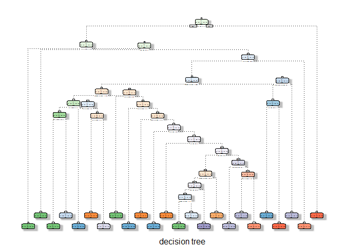

Background
----------

Using devices such as Jawbone Up, Nike FuelBand, and Fitbit it is now
possible to collect a large amount of data about personal activity
relatively inexpensively. These type of devices are part of the
quantified self movement a group of enthusiasts who take measurements
about themselves regularly to improve their health, to find patterns in
their behavior, or because they are tech geeks. One thing that people
regularly do is quantify how much of a particular activity they do, but
they rarely quantify how well they do it.

In this project, you will use data from accelerometers on the belt,
forearm, arm, and dumbell of 6 participants. They were asked to perform
barbell lifts correctly and incorrectly in 5 different ways. More
information is available from the website here:
<http://groupware.les.inf.puc-rio.br/har> (see the section on the Weight
Lifting Exercise Dataset).

The goal of this project is to predict the manner in which they did the
exercise.

Used libraries
--------------

    library(caret)
    library(purrr)
    library(rattle)
    library(rpart)
    library(randomForest)

Getting data
------------

The first step is getting the data from the Internet. If it is already
available on my compter I skip the downloading.

    # set envirnoment variables
    workDir <- 'C:/CourseraDataScientistCourse/08_PracticalMachineLearning/courseProject'

    trainingDataUrl <- 'https://d396qusza40orc.cloudfront.net/predmachlearn/pml-training.csv'
    trainingDataFileName <- 'pml-training.csv'
    trainingDataFileName <- paste(workDir,trainingDataFileName, sep ='/')

    testingDataUrl <- 'https://d396qusza40orc.cloudfront.net/predmachlearn/pml-testing.csv'
    testingDataFileName <- 'pml-testing.csv'
    testingDataFileName <- paste(workDir,testingDataFileName, sep ='/')

    # Download the datas
    if (!file.exists(trainingDataFileName)){
        download.file(trainingDataUrl, trainingDataFileName)
    } else {
        print("Training file has been already downloaded.")
    }

    ## [1] "Training file has been already downloaded."

    if (!file.exists(testingDataFileName)){
        download.file(testingDataUrl, testingDataFileName)
    } else {
        print("Test file has been already downloaded.")
    }

    ## [1] "Test file has been already downloaded."

    # load the datas
    trainingDataSet<- read.csv(trainingDataFileName, sep=",", header=TRUE, na.strings = c("NA","",'#DIV/0!'))
    testingDataSet<- read.csv(testingDataFileName, sep=",", header=TRUE, na.strings = c("NA","",'#DIV/0!'))

    dim(trainingDataSet)

    ## [1] 19622   160

    dim(testingDataSet)

    ## [1]  20 160

Preparation
-----------

The dim functions say there are 160 columns are in the datasets. If you
look into the datasets with head or summary functions you see a lots of
NA's columns. These functions needs a lot of space so I skip include the
results.

### Clean the data

So the next step is to remove the columns which has no data, because it
is not necessary for prediction.

    notNaColumns <- map_lgl(testingDataSet, ~all(!is.na(.)))
    cleanTestingData <- testingDataSet[notNaColumns]

    notNaColumns <- map_lgl(trainingDataSet, ~all(!is.na(.)))
    cleanTrainingData <- trainingDataSet[notNaColumns]

### create training and testing data set

After we removed most of the unrelevant columns lets split the training
data set into 2 partitions. The first one will be the training data set
for making models, the second one will be used for validation. The
suggested ratio for splitting dataset into training and validation
dataset is 70% and 30%.

    set.seed(1973)
    trainData<-createDataPartition(y = cleanTrainingData$classe, p=0.70, list = FALSE)
    trainDataSet <- cleanTrainingData[trainData,]
    testDataSet  <- cleanTrainingData[-trainData,]

Modeling
--------

### Field selection

As the part of the modelling we should select the necessary fields. Some
(eg.: timestamps, text fields ) do not useful to training and prediction
so I removed them, and store the rest in the "inputVariables" variable.

    allVariables <-names(trainDataSet)
    inputVariables <- allVariables[sapply(allVariables,function(x) !x %in% c("X","user_name","raw_timestamp_part_1","raw_timestamp_part_2","cvtd_timestamp","new_window"))]

We can reduce the number of variables checking the correlations between
variables. These are the variablas wich has strong correlation. Becasue
that is few I skip the deeper analysis:

    corMatrix<-cor(trainDataSet[inputVariables[0:53]])
    corMatrix<-round(corMatrix,2)

    o=1
    for (r in 1:53) {
      for (c in 1:o) {
        if (corMatrix[r,c] > 0.85 & corMatrix[r,c]!=1  ) {
          print(paste(rownames(corMatrix)[r],'->',colnames(corMatrix)[c]) )
        } 
      }
      o=o+1

    }

    ## [1] "total_accel_belt -> roll_belt"
    ## [1] "accel_belt_y -> roll_belt"
    ## [1] "accel_belt_y -> total_accel_belt"
    ## [1] "magnet_belt_x -> accel_belt_x"
    ## [1] "gyros_forearm_z -> gyros_dumbbell_z"
    ## [1] "gyros_forearm_z -> gyros_forearm_y"

The classe field is missing for predcition with randomforest algorithm,
so I make based on classe filed in testing data.

    cleanTestingData['classe']<-as.factor("A")
    levels(cleanTestingData$classe)<-levels(trainDataSet$classe)

Prediction with decision tree
-----------------------------

### Training

    modFitDT<-rpart(classe ~ ., data=trainDataSet[inputVariables], method="class")
    fancyRpartPlot(modFitDT, caption = "decision tree")

### Prediction

    predDtree<-predict(modFitDT, testDataSet[inputVariables], type = "class")
    confusionMatrix(predDtree, testDataSet$classe)

    ## Confusion Matrix and Statistics
    ## 
    ##           Reference
    ## Prediction    A    B    C    D    E
    ##          A 1533  102   28   34   19
    ##          B   76  874  111  118  106
    ##          C   10   64  786   46   58
    ##          D   41   99  101  703   81
    ##          E   14    0    0   63  818
    ## 
    ## Overall Statistics
    ##                                           
    ##                Accuracy : 0.801           
    ##                  95% CI : (0.7906, 0.8112)
    ##     No Information Rate : 0.2845          
    ##     P-Value [Acc > NIR] : < 2.2e-16       
    ##                                           
    ##                   Kappa : 0.748           
    ##  Mcnemar's Test P-Value : < 2.2e-16       
    ## 
    ## Statistics by Class:
    ## 
    ##                      Class: A Class: B Class: C Class: D Class: E
    ## Sensitivity            0.9158   0.7673   0.7661   0.7293   0.7560
    ## Specificity            0.9565   0.9134   0.9634   0.9346   0.9840
    ## Pos Pred Value         0.8934   0.6802   0.8154   0.6859   0.9140
    ## Neg Pred Value         0.9662   0.9424   0.9512   0.9463   0.9471
    ## Prevalence             0.2845   0.1935   0.1743   0.1638   0.1839
    ## Detection Rate         0.2605   0.1485   0.1336   0.1195   0.1390
    ## Detection Prevalence   0.2916   0.2184   0.1638   0.1742   0.1521
    ## Balanced Accuracy      0.9362   0.8404   0.8647   0.8319   0.8700

Prediction with random forest
-----------------------------

### Training

    modFitRf<-randomForest(classe ~ ., data=trainDataSet[inputVariables])

### Prediction

    predRftree<-predict(modFitRf, testDataSet[inputVariables], type = "class")
    confusionMatrix(predRftree, testDataSet$classe)

    ## Confusion Matrix and Statistics
    ## 
    ##           Reference
    ## Prediction    A    B    C    D    E
    ##          A 1674    0    0    0    0
    ##          B    0 1139    6    0    0
    ##          C    0    0 1019    7    0
    ##          D    0    0    1  957    0
    ##          E    0    0    0    0 1082
    ## 
    ## Overall Statistics
    ##                                          
    ##                Accuracy : 0.9976         
    ##                  95% CI : (0.996, 0.9987)
    ##     No Information Rate : 0.2845         
    ##     P-Value [Acc > NIR] : < 2.2e-16      
    ##                                          
    ##                   Kappa : 0.997          
    ##  Mcnemar's Test P-Value : NA             
    ## 
    ## Statistics by Class:
    ## 
    ##                      Class: A Class: B Class: C Class: D Class: E
    ## Sensitivity            1.0000   1.0000   0.9932   0.9927   1.0000
    ## Specificity            1.0000   0.9987   0.9986   0.9998   1.0000
    ## Pos Pred Value         1.0000   0.9948   0.9932   0.9990   1.0000
    ## Neg Pred Value         1.0000   1.0000   0.9986   0.9986   1.0000
    ## Prevalence             0.2845   0.1935   0.1743   0.1638   0.1839
    ## Detection Rate         0.2845   0.1935   0.1732   0.1626   0.1839
    ## Detection Prevalence   0.2845   0.1946   0.1743   0.1628   0.1839
    ## Balanced Accuracy      1.0000   0.9994   0.9959   0.9963   1.0000

Prediction with GBM
-------------------

### Training

    controlGBM <- trainControl(method = "repeatedcv", number = 5, repeats = 1)
    modFitGBM  <- train(classe ~ ., data=trainDataSet[inputVariables], method = "gbm",trControl = controlGBM, verbose = FALSE)

### Prediction

    predictGBM <- predict(modFitGBM, newdata=testDataSet[inputVariables])
    confusionMatrix(predictGBM, testDataSet$classe)

    ## Confusion Matrix and Statistics
    ## 
    ##           Reference
    ## Prediction    A    B    C    D    E
    ##          A 1670   10    0    0    2
    ##          B    4 1110    9    8    2
    ##          C    0   17 1014   11    3
    ##          D    0    2    3  942    7
    ##          E    0    0    0    3 1068
    ## 
    ## Overall Statistics
    ##                                           
    ##                Accuracy : 0.9862          
    ##                  95% CI : (0.9829, 0.9891)
    ##     No Information Rate : 0.2845          
    ##     P-Value [Acc > NIR] : < 2.2e-16       
    ##                                           
    ##                   Kappa : 0.9826          
    ##  Mcnemar's Test P-Value : NA              
    ## 
    ## Statistics by Class:
    ## 
    ##                      Class: A Class: B Class: C Class: D Class: E
    ## Sensitivity            0.9976   0.9745   0.9883   0.9772   0.9871
    ## Specificity            0.9972   0.9952   0.9936   0.9976   0.9994
    ## Pos Pred Value         0.9929   0.9797   0.9703   0.9874   0.9972
    ## Neg Pred Value         0.9990   0.9939   0.9975   0.9955   0.9971
    ## Prevalence             0.2845   0.1935   0.1743   0.1638   0.1839
    ## Detection Rate         0.2838   0.1886   0.1723   0.1601   0.1815
    ## Detection Prevalence   0.2858   0.1925   0.1776   0.1621   0.1820
    ## Balanced Accuracy      0.9974   0.9848   0.9910   0.9874   0.9932

Accuracy of the models based on confusion matrix
------------------------------------------------

### Decision tree: 80.10%%

### Random forest: 99,76%

### Generalized Boosted Model: 98,62%

The random forest algorithm is the best, so I apply this model to
predict the 20 rows quiz dataset.

Predicition classe on the 20 rows training data with random forest
------------------------------------------------------------------

The result for the test is:

    predRftree<-predict(modFitRf, cleanTestingData[inputVariables], type = "class")
    predRftree

    ##  1  2  3  4  5  6  7  8  9 10 11 12 13 14 15 16 17 18 19 20 
    ##  B  A  B  A  A  E  D  B  A  A  B  C  B  A  E  E  A  B  B  B 
    ## Levels: A B C D E
